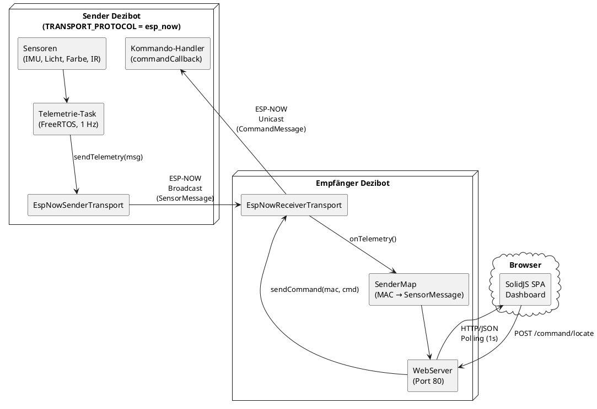
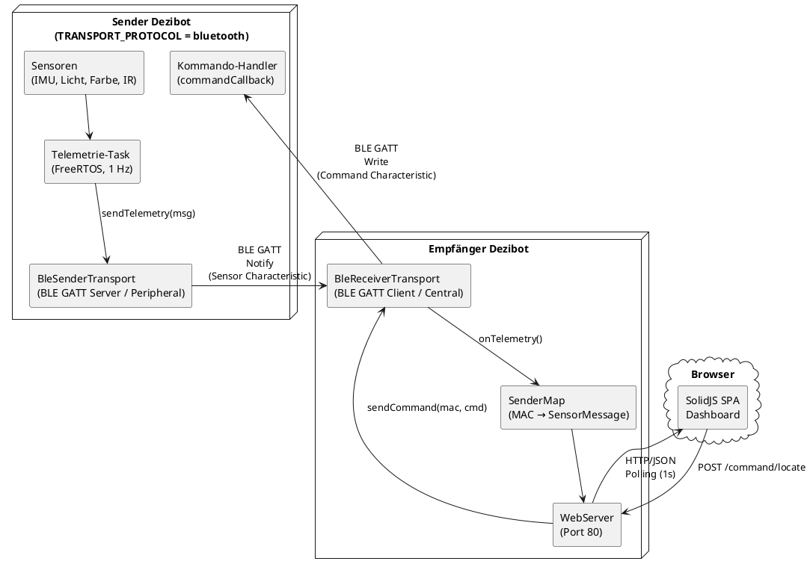
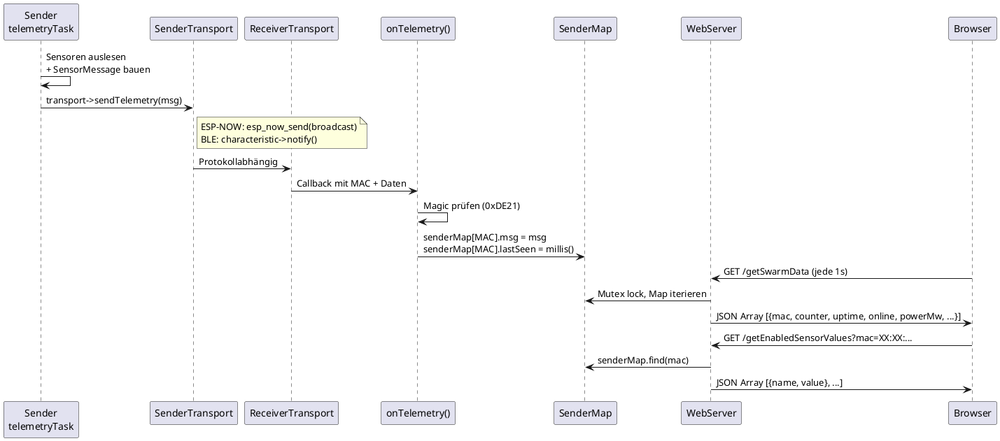
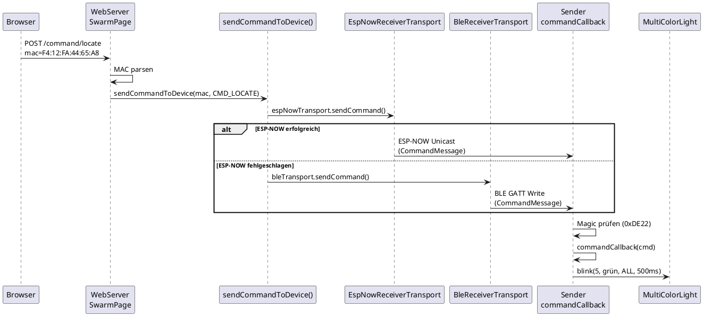
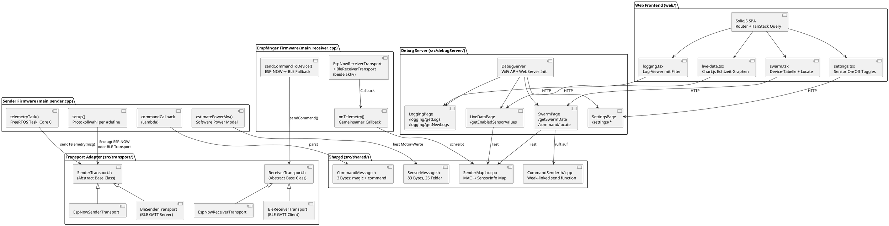

# Dezibot Swarm Logging & Monitoring

Echtzeit-Monitoring und Steuerung mehrerer Dezibot4-Roboter über ein zentrales Web-Dashboard. Sensordaten werden per ESP-NOW von Sender-Dezibots an einen Empfänger-Dezibot gestreamt, der als WiFi Access Point und Webserver fungiert.

## Inhaltsverzeichnis

- [Ausgangslage & Stand der Technik](#ausgangslage--stand-der-technik)
- [Unsere Erweiterungen](#unsere-erweiterungen)
- [Architektur](#architektur)
- [Nachrichtenprotokolle](#nachrichtenprotokolle)
- [Projektstruktur](#projektstruktur)
- [Voraussetzungen](#voraussetzungen)
- [Build & Flash Anleitung](#build--flash-anleitung)
- [Abhängigkeiten & Versionen](#abhängigkeiten--versionen)
- [Web-Oberfläche](#web-oberfläche)
- [Bekannte Einschränkungen](#bekannte-einschränkungen)
- [Ausblick & Erweiterungsideen](#ausblick--erweiterungsideen)
- [Anhang: Entwicklungsrichtlinien (Original)](#anhang-entwicklungsrichtlinien-original)

---

## Ausgangslage & Stand der Technik

### Was existierte

Die [Dezibot4-Bibliothek](https://github.com/dezibot/dezibot) bringt bereits einen eingebauten **Debug Server** mit:

Das Vorgängerprojekt [Dezibot Logging](https://github.com/Tim-Dietrich/dezibot-logging) auf dem dieses Projekt aufbaut, bot eine simple Weboberfläche, auf der man Daten des Dezibots sah.

### Limitierungen

- **Nur ein einzelner Bot**: Der Debug Server zeigt ausschließlich die Sensordaten des eigenen Dezibots an
- **Kein Remote-Monitoring**: Um Sensordaten eines zweiten Bots zu sehen, muss man sich physisch mit dessen WiFi verbinden und er muss auch einen eigenen DebugServer auf dem Gerät hosten.
- **Keine Kommunikation**: Kein Mechanismus um Befehle an andere Bots zu senden oder Daten von mehreren Bots zentral zu sammeln

---

## Unsere Erweiterungen

| Feature | Beschreibung |
|---------|-------------|
| **Multi-Protokoll Transport** | Adapter-Pattern für austauschbare Kommunikation — jeder Sender wählt unabhängig zwischen ESP-NOW oder Bluetooth Low Energy (BLE GATT) |
| **ESP-NOW Sensor-Streaming** | Sender-Dezibots sammeln alle Sensordaten und senden sie per ESP-NOW Broadcast an den Empfänger (1 Hz) |
| **BLE GATT Sensor-Streaming** | Alternative zu ESP-NOW: Sender agiert als BLE Peripheral (GATT Server), Empfänger verbindet sich als Central (GATT Client) und empfängt Notifications |
| **Swarm-Dashboard** | Übersichtsseite zeigt alle verbundenen Bots mit Status (Online/Offline), Uptime, Nachrichtenzähler und geschätzter Leistungsaufnahme |
| **Remote Live-Daten** | Klick auf einen Bot im Swarm-Dashboard öffnet dessen Live-Sensordaten als Echtzeit-Charts |
| **Bidirektionale Kommunikation** | Vom Dashboard aus können Befehle an einzelne Bots gesendet werden (z.B. "Locate" lässt einen Bot mit LEDs blinken) |
| **System-Metriken** | Freier Heap-Speicher, minimaler Heap-Watermark, Anzahl FreeRTOS-Tasks und Chip-Temperatur werden mitgestreamt |
| **Geschätzte Leistungsaufnahme** | Softwarebasierte Schätzung des aktuellen Stromverbrauchs basierend auf Komponentenzuständen (Motoren, CPU, WiFi) (Nur Demo-Feature, nicht zuverlässig) |
| **Hintergrund-Telemetrie** | Telemetrie läuft in eigenem FreeRTOS-Task — Roboter-Logik in `loop()` blockiert nicht mehr das Senden von Sensordaten |
| **Modernes Frontend** | Kompletter Neubau des Frontends zum besseren Monitorings mehrerer Dezibots mit weniger Speicherverbrauch |

---

## Architektur

### Transport-Adapter Pattern

Sender und Empfänger kommunizieren über ein austauschbares Transport-Layer. Jeder Sender wählt unabhängig sein Protokoll (`TRANSPORT_PROTOCOL` Define in `main_sender.cpp`). Der Empfänger lauscht auf **beiden** Protokollen gleichzeitig und führt alle Daten in einer gemeinsamen `SenderMap` zusammen.

```
SenderTransport (abstract)         ReceiverTransport (abstract)
├── EspNowSenderTransport          ├── EspNowReceiverTransport
└── BleSenderTransport             └── BleReceiverTransport
```

### Systemübersicht: ESP-NOW Modus



Der Sender arbeitet im WiFi STA-Modus und sendet per ESP-NOW Broadcast (Kanal 1). Der Empfänger empfängt über seinen SoftAP-Interface und sendet Kommandos per Unicast zurück.

### Systemübersicht: Bluetooth (BLE GATT) Modus



Der Sender agiert als BLE Peripheral (GATT Server) und advertised einen Custom Service (`DE210001-...`). Der Empfänger scannt periodisch nach Dezibots, verbindet sich automatisch und abonniert Sensor-Notifications. Kommandos werden per GATT Write an die Command-Characteristic gesendet.

**BLE GATT Characteristics:**

| Characteristic | UUID | Richtung | Beschreibung |
|---------------|------|----------|-------------|
| Sensor Data | `DE210002-...` | Sender → Empfänger (Notify) | SensorMessage (83 Bytes), 1 Hz |
| Command | `DE210003-...` | Empfänger → Sender (Write) | CommandMessage (3 Bytes) |

### Datenfluss: Sensordaten (Sender → Dashboard)



### Datenfluss: Kommandos (Dashboard → Sender)



### Komponentendiagramm



---

## Nachrichtenprotokolle

### SensorMessage (83 Bytes, packed)

Wird per ESP-NOW Broadcast vom Sender zum Empfänger gesendet (1 Hz).

| Feld | Typ | Bytes | Beschreibung |
|------|-----|-------|-------------|
| `magic` | `uint16_t` | 2 | Protokoll-Kennung `0xDE21` |
| `counter` | `uint32_t` | 4 | Laufender Nachrichtenzähler |
| `uptimeMs` | `uint32_t` | 4 | Betriebszeit in Millisekunden |
| `ambientLight` | `float` | 4 | Umgebungslicht (VEML6040) |
| `colorR` | `uint16_t` | 2 | Rot-Kanal (VEML6040) |
| `colorG` | `uint16_t` | 2 | Grün-Kanal (VEML6040) |
| `colorB` | `uint16_t` | 2 | Blau-Kanal (VEML6040) |
| `colorW` | `uint16_t` | 2 | Weiß-Kanal (VEML6040) |
| `irFront` | `uint16_t` | 2 | IR-Sensor vorne |
| `irLeft` | `uint16_t` | 2 | IR-Sensor links |
| `irRight` | `uint16_t` | 2 | IR-Sensor rechts |
| `irBack` | `uint16_t` | 2 | IR-Sensor hinten |
| `dlBottom` | `uint16_t` | 2 | Daylight-Sensor unten |
| `dlFront` | `uint16_t` | 2 | Daylight-Sensor vorne |
| `motorLeft` | `uint16_t` | 2 | PWM Duty linker Motor (0–8192) |
| `motorRight` | `uint16_t` | 2 | PWM Duty rechter Motor (0–8192) |
| `accelX/Y/Z` | `int16_t` | 6 | Beschleunigung (IMU) |
| `gyroX/Y/Z` | `int16_t` | 6 | Rotation (IMU) |
| `temperature` | `float` | 4 | IMU-Temperatur |
| `whoAmI` | `int8_t` | 1 | IMU Chip-ID |
| `tiltX` | `int32_t` | 4 | Neigung X |
| `tiltY` | `int32_t` | 4 | Neigung Y |
| `tiltDirection` | `uint8_t` | 1 | Neigungsrichtung (Enum) |
| `freeHeap` | `uint32_t` | 4 | Freier Heap-Speicher (Bytes) |
| `minFreeHeap` | `uint32_t` | 4 | Minimaler Heap seit Boot (Bytes) |
| `taskCount` | `uint8_t` | 1 | Anzahl FreeRTOS-Tasks |
| `chipTemp` | `float` | 4 | Interne Chip-Temperatur (°C) |
| `estimatedPowerMw` | `uint16_t` | 2 | Geschätzte Leistung (mW) |

ESP-NOW erlaubt maximal 250 Bytes pro Paket — mit 83 Bytes ist ausreichend Platz für zukünftige Erweiterungen.

### CommandMessage (3 Bytes, packed)

Wird per ESP-NOW Unicast vom Empfänger an einen einzelnen Sender gesendet.

| Feld | Typ | Bytes | Beschreibung |
|------|-----|-------|-------------|
| `magic` | `uint16_t` | 2 | Protokoll-Kennung `0xDE22` |
| `command` | `uint8_t` | 1 | Befehlstyp |

Aktuell implementierte Befehle:

| Befehl | Wert | Aktion auf dem Sender |
|--------|------|----------------------|
| `CMD_LOCATE` | `0x01` | LEDs blinken 5× grün (500ms Intervall) |

### Magic Numbers

Die Magic Numbers (`0xDE21` für Sensor, `0xDE22` für Kommandos) dienen als Protokoll-Diskriminator. Da ESP-NOW keine eingebaute Nachrichtentypisierung hat, unterscheiden sie:
- Verschiedene Nachrichtentypen (Sensor vs. Kommando)
- Eigene Nachrichten von fremden ESP-NOW-Paketen auf dem gleichen Kanal
- Beschädigte oder unvollständige Pakete

---

## Projektstruktur

```
dezibot-swarm-logging/
├── platformio.ini              # PlatformIO Build-Konfiguration (3 Environments)
├── library.properties          # Arduino Library Metadaten
│
├── src/
│   ├── main_sender.cpp         # Sender-Firmware: Telemetrie-Task + Kommando-Handler
│   ├── main_receiver.cpp       # Empfänger-Firmware: ESP-NOW Empfang + Kommando-Senden
│   ├── Dezibot.h / .cpp        # Hauptklasse, initialisiert alle Komponenten
│   │
│   ├── transport/              # Transport-Adapter Pattern (Protokoll-Abstraktion)
│   │   ├── SenderTransport.h   # Abstrakte Basisklasse (Sender-Seite)
│   │   ├── ReceiverTransport.h # Abstrakte Basisklasse (Empfänger-Seite)
│   │   ├── EspNowSenderTransport.h/.cpp   # ESP-NOW Sender-Implementierung
│   │   ├── EspNowReceiverTransport.h/.cpp # ESP-NOW Empfänger-Implementierung
│   │   ├── BleSenderTransport.h/.cpp      # BLE GATT Server (Peripheral)
│   │   └── BleReceiverTransport.h/.cpp    # BLE GATT Client (Central)
│   │
│   ├── shared/                 # Gemeinsame Definitionen (Sender + Empfänger)
│   │   ├── SensorMessage.h     # Sensor-Nachrichtenformat (83 Bytes)
│   │   ├── CommandMessage.h    # Kommando-Nachrichtenformat (3 Bytes)
│   │   ├── SenderMap.h / .cpp  # MAC → SensorInfo Map mit Mutex
│   │   └── CommandSender.h/.cpp# Weak-linked Funktion zum Senden von Kommandos
│   │
│   ├── debugServer/            # Webserver und Seitenhandler
│   │   ├── DebugServer.h/.cpp  # WiFi AP Setup, WebServer Init, Sensor-Registrierung
│   │   ├── SwarmPage.h/.cpp    # /getSwarmData + /command/locate Endpoints
│   │   ├── LiveDataPage.h/.cpp # /getEnabledSensorValues (lokal + remote)
│   │   ├── LoggingPage.h/.cpp  # /logging/getLogs + /logging/getNewLogs
│   │   ├── SettingsPage.h/.cpp # /settings/getSensorData + /settings/toggleFunction
│   │   ├── MainPage.h/.cpp     # / (SPA Shell aus SPIFFS)
│   │   └── PageProvider.h/.cpp # Basisklasse, SPIFFS-Datei-Serving
│   │
│   ├── logger/                 # Logging-System
│   │   ├── Logger.h/.cpp       # Singleton, Timer-basiert
│   │   └── LogDatabase.h/.cpp  # Ringpuffer (500 Einträge)
│   │
│   ├── motion/                 # Motorsteuerung + IMU
│   ├── multiColorLight/        # RGB LED Steuerung (NeoPixel)
│   ├── colorDetection/         # VEML6040 Farbsensor
│   ├── lightDetection/         # IR + Daylight Sensoren
│   ├── infraredLight/          # IR LED Steuerung
│   ├── display/                # OLED Display
│   └── communication/          # painlessMesh (nicht aktiv genutzt)
│
├── web/                        # Frontend (SolidJS SPA)
│   ├── package.json            # NPM Abhängigkeiten
│   ├── vite.config.ts          # Vite Build-Konfiguration (Output → ../data/)
│   ├── tsconfig.json           # TypeScript Konfiguration
│   ├── index.html              # HTML Entry Point
│   └── src/
│       ├── index.tsx            # App Mount
│       ├── app.tsx              # Router + QueryClient Setup
│       ├── app.css              # Tailwind CSS Imports + Theme
│       ├── api/
│       │   └── client.ts        # API Funktionen (fetch Wrapper + TypeScript Interfaces)
│       ├── pages/
│       │   ├── home.tsx         # Startseite
│       │   ├── swarm.tsx        # Geräteübersicht mit Status + Locate + Power
│       │   ├── live-data.tsx    # Echtzeit-Sensorgraphen per Gerät
│       │   ├── logging.tsx      # Log-Viewer mit Level-Filter
│       │   ├── settings.tsx     # Sensor-Aktivierung Toggles
│       │   └── not-found.tsx    # 404 Seite
│       ├── components/
│       │   ├── layout.tsx       # App Shell mit Navigation
│       │   ├── sensor-chart.tsx # Chart.js Wrapper für Echtzeit-Liniendiagramme
│       │   └── ui/              # UI Komponenten (shadcn/solid Stil)
│       └── lib/
│           └── utils.ts         # Utility Funktionen (cn, clsx)
│
└── data/                       # SPIFFS Daten (generiert durch `npm run build`)
    ├── index.html              # SPA Shell
    └── assets/
        ├── index-*.js          # Gebündeltes JavaScript
        └── index-*.css         # Gebündeltes CSS
```

---

## Voraussetzungen

### Software

| Tool | Version | Zweck |
|------|---------|-------|
| [PlatformIO](https://platformio.org/) | CLI oder VS Code Extension | Firmware kompilieren & flashen |
| [Node.js](https://nodejs.org/) | ≥ 18 | Frontend Build-Toolchain |
| npm | (mit Node.js) | Paketmanager für Frontend-Dependencies |
| Web Packages | package.json | Alle verwendeteten Frontend-Abhängigkeiten sind Open-Source und finden sich unter `/web/package.json`.

### Hardware

- Mindestens **1 Dezibot4** mit ESP32-S3 
- USB-Kabel zum Flashen
- Computer im selben Raum (WiFi-Reichweite zum Empfänger-AP)

---

## Build & Flash Anleitung

### 1. Frontend bauen

Das Frontend wird als SPA gebaut und in den `data/` Ordner geschrieben, der dann per SPIFFS auf den Empfänger hochgeladen wird.

```bash
cd web
npm install
npm run build
```

Ergebnis: `data/index.html`, `data/assets/index-*.js`, `data/assets/index-*.css`

### 2. SPIFFS-Daten auf den Empfänger hochladen

```bash
pio run -e esp32s3_receiver -t uploadfs
```

### 3. Empfänger flashen

```bash
pio run -e esp32s3_receiver -t upload
```

Der Empfänger startet einen WiFi Access Point. Die SSID und IP-Adresse werden über die serielle Konsole ausgegeben (Standard: `192.168.1.1`).

### 4. Sender flashen

Vor dem Flashen kann das Transportprotokoll in `src/main_sender.cpp` gewählt werden:

```cpp
#define TRANSPORT_PROTOCOL "esp_now"   // Standard: ESP-NOW Broadcast
#define TRANSPORT_PROTOCOL "bluetooth" // Alternativ: BLE GATT
```
PW4studProj
Jeder Sender kann unabhängig ein anderes Protokoll verwenden. Der Empfänger unterstützt beide gleichzeitig.

```bash
pio run -e esp32s3_sender -t upload
```

Für ESP32-DevKit-Boards (z.B. der Dezibot 3):

```bash
pio run -e esp32_sender -t upload
```

### 5. Dashboard öffnen

1. Mit dem WiFi des Empfänger-Dezibots verbinden
2. Browser öffnen: `http://192.168.1.1`
3. Unter "Swarm" erscheinen die Sender-Dezibots sobald sie Daten senden

### Serielle Konsole

```bash
pio device monitor -e esp32s3_receiver
pio device monitor -e esp32s3_sender
```

---

## Abhängigkeiten & Versionen

### Firmware (PlatformIO)

| Bibliothek | Version | Zweck |
|-----------|---------|-------|
| `espressif32` (Platform) | latest | ESP32 Arduino Framework |
| `arduino` (Framework) | ESP-IDF v4.x basiert | Arduino Kompatibilitätsschicht |
| `thewknd/VEML6040` | ^0.3.2 | RGBW Farbsensor Treiber |
| `painlessmesh/painlessMesh` | ^1.5.4 | Mesh-Netzwerk (transitive Abhängigkeit, nicht aktiv genutzt) |
| `adafruit/Adafruit NeoPixel` | ^1.12.4 | RGB LED Steuerung |
| `bblanchon/ArduinoJson` | ^7.4.2 | JSON Serialisierung für HTTP API |

Board: `esp32s3usbotg` (ESP32-S3-USB-OTG)

Build Flags:
```
-DARDUINO_USB_CDC_ON_BOOT=1
-DARDUINO_USB_MODE=1
```

### Frontend (npm)

Zum Zeitpunkt der fertigstellung wurden folgende Frontend-Versionen verwendet. Siehe `web/package.json`

| Paket | Version | Zweck |
|-------|---------|-------|
| `solid-js` | ^1.9.4 | Reaktives UI Framework |
| `@solidjs/router` | ^0.15.3 | Client-side Routing |
| `@tanstack/solid-query` | ^5.62.16 | Server State Management + Polling |
| `chart.js` | ^4.4.7 | Echtzeit-Liniendiagramme |
| `@kobalte/core` | ^0.13.7 | Accessible UI Primitives (shadcn/solid Basis) |
| `tailwindcss` | ^4.0.0 | Utility-first CSS Framework |
| `class-variance-authority` | ^0.7.1 | Komponentenvarianten |
| `clsx` | ^2.1.1 | Conditional CSS Klassen |
| `tailwind-merge` | ^2.6.0 | Tailwind Klassen-Deduplizierung |
| `vite` | ^6.0.0 | Build Tool + Dev Server |
| `vite-plugin-solid` | ^2.11.0 | SolidJS Vite Integration |
| `typescript` | ^5.7.3 | Typsystem |
| `@tailwindcss/vite` | ^4.0.0 | Tailwind Vite Plugin |

---

## Web-Oberfläche

Das Frontend ist eine Single-Page Application die über SPIFFS vom Empfänger-Dezibot ausgeliefert wird. Alle Daten werden per HTTP Polling abgefragt.

### Startseite (`/`)

Willkommensseite mit Links zu den anderen Bereichen.

### Swarm (`/swarm`)

Übersichtstabelle aller verbundenen Dezibots:

| Spalte | Beschreibung |
|--------|-------------|
| Status | Online (grün) / Offline (rot) — basierend auf letzter Nachricht < 5 Sekunden |
| MAC Address | Hardware-Adresse des Senders |
| Messages | Anzahl empfangener Nachrichten |
| Uptime | Betriebszeit des Senders |
| Last Seen | Zeitstempel der letzten Nachricht |
| Power | Geschätzte Leistungsaufnahme in mW / W |
| Actions | "Locate" Button — lässt den Bot mit LEDs blinken |

Klick auf eine Zeile öffnet die Live-Daten des jeweiligen Bots.

### Live Data (`/livedata?mac=XX:XX:XX:XX:XX:XX`)

Echtzeit-Sensorgraphen für einen einzelnen Bot. Jeder Sensorwert wird als eigenes Chart.js Liniendiagramm dargestellt. Der Slider oben steuert die Anzahl der angezeigten Datenpunkte (50–2000).

Angezeigte Werte (Remote-Bot): Alle Felder der SensorMessage einschließlich System-Metriken und geschätzter Leistungsaufnahme.

### Logging (`/logging`)

Log-Viewer mit Level-Filter (ALL, INFO, WARNING, ERROR, DEBUG, TRACE). Logs werden per Polling nachgeladen. Zeigt Logging-Einträge der Dezibot-Bibliotheksmodule und empfangene ESP-NOW Nachrichten.

### Settings (`/settings`)

Aktivierung und Deaktivierung einzelner Sensorfunktionen auf dem lokalen Empfänger-Dezibot.

---

## Bekannte Einschränkungen

### BLE Verbindungslimit

Der ESP32-S3 unterstützt ca. 7–9 gleichzeitige BLE-Verbindungen (konfigurationsabhängig). Für große Schwärme müsste ein BLE Mesh aufgebaut werden, dies ist nicht implementiert. ESP-NOW hat diese Einschränkung nicht (Broadcast-basiert). In gemischten Setups empfiehlt es sich mit dem aktuellen ProjektstandESP-NOW für die Mehrzahl der Sender und BLE nur für einzelne Test-Dezibots.

### BLE Verbindungsaufbau

Der BLE-Empfänger scannt alle 10 Sekunden nach neuen Dezibots. Zwischen dem Einschalten eines BLE-Senders und dem Erscheinen im Dashboard können bis zu ~15 Sekunden vergehen (Scan-Intervall + Verbindungsaufbau + Service Discovery). ESP-NOW-Sender erscheinen sofort nach dem ersten Broadcast.

### Übertragungs-Kanal

Sender und Empfänger müssen auf dem gleichen Übertragungs-Kanal arbeiten. Der Sender setzt Kanal 1 explizit (`esp_wifi_set_channel`). Der Empfänger betreibt einen SoftAP, dessen Kanal standardmäßig 1 ist. Bei Problemen muss der Kanal manuell abgeglichen werden.

### Locate-Befehl blockiert

`multiColorLight.blink()` blockiert den aufrufenden Thread für ~5 Sekunden. Auf dem Sender läuft der Kommando-Handler im WiFi-Task-Kontext, d.h. während des Blinkens werden keine ESP-NOW Pakete empfangen. Der Telemetrie-Task auf Core 0 läuft jedoch weiter.

### Power-Estimation Genauigkeit

Die Leistungsschätzung ist eine softwarebasierte Näherung (~±30–50%):

| Komponente | Schätzung |
|-----------|-----------|
| ESP32-S3 CPU + WiFi idle | 500 mW (konstant) |
| ESP-NOW TX Burst | 165 mW (konstant) |
| IMU Sensor | 5 mW (konstant) |
| Farbsensor | 3 mW (konstant) |
| Display | 50 mW (konstant) |
| Motor links/rechts | 0–990 mW je, linear mit PWM Duty |

Nicht berücksichtigt: LED-Zustand (nicht im SensorMessage), tatsächliche Motorlast (nur PWM Duty, nicht Strom), WiFi TX Power Variation.

### Chip-Temperatur

Nutzt die Legacy-API `driver/temp_sensor.h` (ESP-IDF v4.x). Genauigkeit ~±2–3°C, misst die Chip-Temperatur, nicht die Umgebungstemperatur.

### Thread-Safety LogDatabase

`LogDatabase::getLogs()` gibt eine Referenz auf den internen Vektor zurück. Der Mutex wird nur innerhalb der Funktion gehalten. Bei gleichzeitigem `addLog()` durch einen anderen Thread kann es theoretisch zu Race Conditions kommen. `getNewLogs()` ist davon nicht betroffen (gibt eine Kopie zurück).

---

## Ausblick & Erweiterungsideen

- **OTA Firmware Update** — Firmware-Binary über das Web-UI hochladen und per ESP-NOW an Sender verteilen (chunked transfer)
- **Device Naming** — Menschenlesbare Namen für MAC-Adressen vergeben ("Bot-Rot", "Bot-Blau")
- **Sensor-Daten Export** — Aufzeichnung und Download als CSV/JSON für Analyse in Excel/Python
- **Remote Command Console** — Erweiterte Fernsteuerung: Motoren starten/stoppen, LED-Farben setzen, synchronisierte Aktionen
- **Alert System** — Schwellwerte definieren (z.B. Heap < 50KB), Warnungen im Dashboard anzeigen
- **CPU-Auslastung** — Per-Core CPU-Nutzung via FreeRTOS Runtime Stats (benötigt `CONFIG_FREERTOS_GENERATE_RUN_TIME_STATS=y`)
- **RSSI-basierte Proximity** — Signalstärke der ESP-NOW Pakete auswerten für grobe Entfernungsschätzung zwischen Bots
- **Batteriespannung** — Falls ein ADC-Pin mit einem Spannungsteiler an der Batterie verbunden ist, könnte der Ladestand angezeigt werden

---

## Anhang: Entwicklungsrichtlinien (Original)

Die folgenden Richtlinien stammen aus der originalen Dezibot4-Bibliothek und gelten weiterhin für Erweiterungen.

### Code Conventions

- Methoden: `lowerCamelCase`
- Klassen: `UpperCamelCase`
- Ordner: `lowerCamelCase`
- Konstanten: `ALL_CAPS_SNAKE_CASE`
- Keine Referenzen als Parameter übergeben (Zugänglichkeit für C++-Einsteiger)
- `.h` Dateien mit relativen Pfaden inkludieren

### Komponenten-Struktur

Jede Komponente hat eine eigene `.h` Datei und einen oder mehrere `.cpp` Dateien in einem separaten Ordner unter `src/`.

```c++
#ifndef ClassName_h
#define ClassName_h
class ClassName {
};
#endif //ClassName_h
```

### Branching

- Branches: `prefix/#issueid-shortdescription` (prefix: feature, fix, refactor)
- Merge Requests gegen Develop-Branch
- Mindestens ein Approve durch Owner
- Versionsnummer in `library.properties` nach Semantic Versioning hochzählen

### Commit Messages

[gitchangelog](https://github.com/vaab/gitchangelog/blob/master/src/gitchangelog/gitchangelog.rc.reference) Pattern.

### Arduino Settings

- Board: "ESP32-S3-USB-OTG"
- Upload Mode: "UART0 / Hardware CDC"
- USB Mode: "Hardware CDC and JTAG"
- Programmer: "Esptool"

### Dokumentation

- Sprache: Amerikanisches Englisch
- Doxygen-Kommentare in `.h` Dateien (`@file`, `@author`, `@brief`, `@param`, `@return`)
- Hardware- und Software-Dokumentation: [docs.dezibot.de](https://docs.dezibot.de/)

### Third-Party Lizenzen

- `VEML6040` (v0.3.2) — MIT License — [Repository](https://github.com/thewknd/VEML6040/blob/master/LICENSE)
- `canvasJS` (v3.12.7) — CC BY-NC 3.0 — (im Original-Frontend, durch Chart.js ersetzt)
